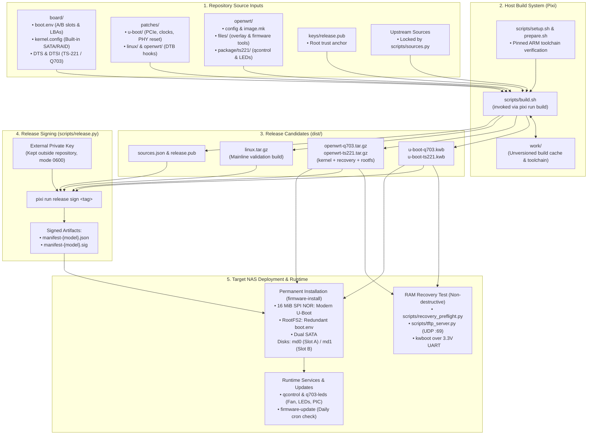

# OpenWrt firmware for QNAP TS-221 and Fujitsu CELVIN Q703

This project builds firmware for two network-attached storage (NAS) models:
the **QNAP TS-221** and the **Fujitsu CELVIN Q703** (Marvell Kirkwood 88F6282 SoC,
1 GiB RAM). It includes OpenWrt, the U-Boot bootloader, installation tools,
and a signed update system. It also builds a separate latest-stable Linux kernel
for development and distribution validation. Upstream sources are downloaded
during the build; no other project checkout is needed. Upstream releases are
refreshed every 14 days.

At the time of writing, patches and builds based on them, have been tested
only on a singular Fujitsu CELVIN Q703 device. If you own **QNAP TS-221**,
or another CELVIN Q703, please help me out, and **get in contact with me**.

> **Experimental firmware:** The current artifacts have not completed recovery,
> installation, and rollback testing on each supported model. Building
> successfully does not prove that an image will boot. Do not write an untested
> U-Boot image to the NAS's flash memory.

Run all build commands from the repository root, which contains `pixi.toml`.
Paths such as `dist/`, `work/`, and `keys/` below refer to the repository root.

## Host prerequisites

| Requirement | Check | Expected |
|---|---|---|
| Operating system | `uname -s` | `Linux` |
| Architecture | `uname -m` | `x86_64` |
| Pixi | `pixi --version` | `0.79.x` |
| Free space | `df -h .` | At least 40 GiB available |
| Git | `git --version` | Command succeeds |
| Host tools | `command -v ip ss ssh sudo` | Each path is printed |

Run these checks before preparing a build. The guides assume a Linux x86-64
host; they do not provide a native macOS or Windows procedure.

If you use macOS, BSD, or a **non-x86-64 Linux** system, please **share your
experience** and any extra steps needed to make the build work.

## Hardware needed

For RAM recovery and first installation:

 - A Fujitsu CELVIN Q703 or QNAP TS-221.
 - A 3.3 V USB-to-TTL UART adapter with jumper wires. Leave VCC disconnected.
 - A wired Ethernet connection between the NAS and the build host.
 - Stable power for the NAS.

For permanent installation, also prepare:

 - Two blank or fully backed-up internal disks.
 - A separate writable ext4 drive for backups.
 - Verified off-NAS backups of all data, disk and RAID metadata, NOR, boot
    settings, and the original boot path.

## Where to start

| What you want to do | Where to go |
|---|---|
| Understand or build the firmware | Continue with this page |
| Try recovery without permanently installing | Follow [installation steps 1–7](docs/install.md#1-prepare-artifacts-and-terminals), then [cleanup](docs/install.md#cleanup) |
| Install permanently | Follow the [complete installation guide](docs/install.md) |
| Update an already installed NAS | Read [updates, steps 5–7](docs/update.md#5-install-a-newer-openwrt-release) |
| Sign a release or publish downloads | Read [signing and releases](docs/update.md) |

Permanent installation replaces both system volumes, boot settings, and the
bootloader. Read the installation guide and its backup requirements before
starting. There is no in-place migration from QTS.

### Values to review before pasting commands

| Value | Example | Verify |
|---|---|---|
| `MODEL` | `q703` | Exact NAS model |
| `GITHUB_REPOSITORY` | `mbledkowski/ts221` | Intended update source; this is the project's release repository when using its published updates |
| `NAS_IP` / `HOST_IP` | `.108` / `.110` | Reserved LAN addresses |
| `UPDATE_TAG` | `v2026.09.12.3` | Exact signed release |
| Backup device | `/dev/sdc1` | Model, serial number, and capacity |

Do not replace a repository value with an example-shaped placeholder: the
format checks accept a syntactically valid name, not proof that it is yours.

### Glossary for beginners

- **Build host:** The Linux x86-64 computer that creates the firmware files.
- **U-Boot:** The bootloader that starts before Linux and loads the operating system.
- **NOR:** The NAS's built-in 16 MiB SPI flash memory, which holds its single
  bootloader and persistent boot settings. It has no A/B fallback.
- **UART / kwboot:** A 3.3 V TTL serial connection to the board. `kwboot` is the
  tool that pushes a U-Boot image into the board's RAM over serial.
- **TFTP:** Trivial File Transfer Protocol; transfers the recovery image from
  the build host to the NAS over the local network.
- **RAM recovery:** A temporary rescue system loaded into NAS memory for testing
  and repair. Running in RAM does not, by itself, prevent software from writing
  to disks. Settings vanish at power-off.
- **Slot A / Slot B:** Two independent mirrored system volumes (RAID1 arrays
  `md0` and `md1`). Updates install to the inactive slot so the previous system
  remains available for rollback.
- **Boot environment:** Persistent settings (read with `fw_printenv`) stored
  redundantly in NOR (`RootFS2` partition) that track active/rollback slots,
  release sequence, and boot count.
- **Manifest:** A signed file listing release sequence, project commit, file
  hashes, and sizes. The device refuses unsigned updates.
- **Pixi:** The tool ([https://pixi.prefix.dev/](https://pixi.prefix.dev/)) that
  provides the isolated build environment from `pixi.lock`.
- **`sysupgrade`:** OpenWrt's generic upgrade tool. It must **never** be used on
  this disk layout.

## In this repository

### Directory structure
```
  final/
  ├── .github/                               # [CI] GitHub Actions configuration
  │   └── workflows/
  │       └── build.yml                      # Runs tests/lint; builds and uploads unsigned candidates on scheduled or manual runs
  │
  ├── .gitignore                             # [Git] Excludes work/, dist/, local environments, caches, and agent metadata
  │
  ├── .pixi/                                 # [Host] Local Pixi behavior committed with the project
  │   └── config.toml                        # Stores Pixi environments outside checkout paths that may contain whitespace
  │
  ├── LICENSE                                # [Legal] Default AGPL-3.0-or-later license with per-file SPDX exceptions
  │
  ├── README.md                              # [Docs] Project overview, host setup, build commands, artifact descriptions, and runbook routing
  │
  ├── board/                                 # [Board] Shared hardware definitions and boot contract
  │   ├── boot.env                           # Persistent U-Boot A/B slots, raw kernel LBAs, boot counters, fallback, and kernel arguments
  │   ├── kernel.config                      # Boot-critical SATA, RAID, ext4, GPIO, RTC, and power-control kernel options
  │   ├── q703.dts                           # Fujitsu Q703 device-tree source with HDD LEDs, eSATA reset, and tested SPI-NOR identity
  │   ├── ts221-common.dtsi                  # Shared 88F6282 platform: RAM, buttons, Ethernet PHY, PCIe, and common peripherals
  │   └── ts221.dts                          # QNAP TS-221 device-tree wrapper and model identity (no front panel patches, because I do not know if q703 and ts221 have the same front panels)
  │
  ├── docs/                                  # [Docs] Operator-facing installation and maintenance runbooks
  │   ├── install.md                         # Build, preflight, TFTP, UART RAM boot, disk initialization, backup, and NOR activation
  │   └── update.md                          # Signing, qualification, publication, automatic/manual updates, confirmation, and rollback
  │
  ├── keys/                                  # [Trust] Public release identity
  │   └── release.pub                        # Ed25519 public key embedded in OpenWrt and copied to dist/release.pub
  │
  ├── openwrt/                               # [Target] OpenWrt build configuration, rootfs overlay, and hardware package
  │   ├── config                             # Selects both models, initramfs/rootfs images, storage tools, updater, and board package
  │   │
  │   ├── files/                             # Files copied directly into the generated OpenWrt root filesystem
  │   │   ├── etc/
  │   │   │   ├── crontabs/
  │   │   │   │   └── root                   # Runs /usr/sbin/firmware-update daily at 05:23
  │   │   │   └── mke2fs.conf                # Filesystem defaults used when firmware-install formats system slots
  │   │   │
  │   │   └── usr/
  │   │       ├── lib/
  │   │       │   └── firmware.sh            # Shared board, manifest-signature, size, repository, sequence, and SHA-256 verification
  │   │       └── sbin/
  │   │           ├── firmware-install       # Formats/populates A/B slots, manages boot state, confirms trials, and backs up/flashes NOR
  │   │           └── firmware-update        # Downloads and verifies signed releases, stages them, and invokes firmware-install
  │   │
  │   ├── image.mk                           # Defines Q703/TS-221 images, model-specific DTBs, and the 0x02000000 kernel load address
  │   │
  │   └── package/
  │       └── ts221/                         # Hardware-service package shared by TS-221 and Q703
  │           ├── Makefile                   # Downloads and patches qcontrol, builds q703-pic, and installs the package files
  │           │
  │           ├── files/
  │           │   ├── defaults               # Configures DHCP, safe RAID mounting, and disabled-by-default automatic NOR activation
  │           │   ├── q703-leds              # Monitors RAID/SoC health and controls Q703 HDD fault LEDs and thermal fail-safe
  │           │   ├── qcontrol.conf          # Defines fan control, temperature handling, buttons, and PIC event behavior
  │           │   └── ts221.init             # Starts qcontrol, boot confirmation, and the Q703-specific LED monitor
  │           │
  │           ├── patches/
  │           │   ├── 1-events.patch         # Makes qcontrol dispatch every PIC event byte received in one read window
  │           │   └── 2-fan.patch            # Adds LAN/eSATA events, repeated fan commands, and cross-build configuration
  │           │
  │           └── src/
  │               └── q703-pic.c             # Write-only emergency PIC helper used without competing with qcontrol’s PIC reader
  │
  ├── patches/                               # [Build] Changes applied to verified upstream source archives
  │   ├── linux/
  │   │   └── board.patch                    # Registers both compatible strings and builds the Q703 and TS-221 DTBs
  │   │
  │   ├── openwrt/
  │   │   └── ts221.patch                    # Registers both DTBs in OpenWrt’s Kirkwood kernel build
  │   │
  │   └── u-boot/
  │       ├── 1-board.patch                  # Adds the shared board port, Ethernet support, redundant environment, and A/B boot
  │       ├── 2-clocks.patch                 # Adds Kirkwood peripheral clock control required by PCIe
  │       ├── 3-pcie-init.patch              # Restores the 88F6282 PCIe initialization sequence
  │       ├── 4-pcie-windows.patch           # Configures the correct per-port Kirkwood PCIe memory windows
  │       └── 5-phy-reset.patch              # Resets and restarts the Ethernet PHY after cold or warm boot
  │
  ├── pixi.lock                              # [Host] Exact resolved versions of the host build and check environments
  │
  ├── pixi.toml                              # [Host] Linux platform, dependencies, ARM toolchain identity, and public task definitions
  │
  ├── scripts/                               # [Host] Source, build, release, and recovery utilities
  │   ├── build.sh                           # Combines locked sources, board files, patches, OpenWrt files, and the public key into dist/
  │   ├── prepare.sh                         # Verifies native C/C++, Python headers, U-Boot host tools, and ARMv5 cross-compilation
  │   ├── recovery_preflight.py              # Validates and freezes the selected U-Boot and recovery-image pair for RAM testing
  │   ├── release.py                         # Creates/verifies signed manifests and uploads an optional GitHub draft release
  │   ├── setup.sh                           # Downloads, verifies, and atomically installs the pinned ARM cross-compiler
  │   ├── sources.py                         # Resolves upstream releases and safely downloads, verifies, caches, and extracts them
  │   └── tftp_server.py                     # Temporary ACK-aware TFTP server used to transfer recovery.uImage to U-Boot
  │
  └── tests/                                 # [Test] Python unittest suite for build, release, recovery, and device behavior
      ├── test_boot.py                       # Exercises board/boot.env slot selection, disk fallback, bootcount, and rollback logic
      ├── test_build.py                      # Checks Pixi setup, source refresh, patches, OpenWrt assembly, and output invariants
      ├── test_guide_flow.py                 # Extracts and tests executable shell blocks from install.md and update.md
      ├── test_install.py                    # Simulates initialization, inactive-slot updates, confirmation, backup, and NOR safeguards
      ├── test_recovery_preflight.py         # Tests U-Boot limits and immutable recovery-session staging
      ├── test_release.py                    # Tests manifest contents, signatures, asset consistency, and draft publication
      ├── test_sources.py                    # Tests source resolution, HTTPS enforcement, hashes, caching, and safe extraction
      ├── test_tftp_server.py                # Tests TFTP requests, ACK handling, retries, cancellation, and path confinement
      └── test_update.py                     # Simulates downloads, signature failures, replay protection, staging, and optional NOR updates
```

### Chart representing the architecture



## Build

These build instructions are for maintainers and developers. For a first
installation, follow the ordered runbook in [the installation guide](docs/install.md),
which integrates build checks with hardware validation.

### 1. Prepare the build computer

You need Linux x86-64, [Pixi 0.79.x](https://pixi.prefix.dev/), and at least
40 GiB of free disk space.

**Execution context:** [Host]
```sh
pixi install --locked
pixi run setup
```

The first command installs the versions pinned in `pixi.lock` into Pixi's cache.
The second downloads the pinned ARM compiler into `work/` and checks its SHA-256
checksum. Pixi supplies Python, native compilers, libraries, build utilities,
Bubblewrap, ShellCheck, and the GitHub CLI. You do not need host development
packages from apt or packages added to system Python. The host supplies its
shell and runtime. U-Boot builds its own Python libfdt binding; OpenWrt builds
its own target toolchain.

Now verify that the host can build the required programs:

**Execution context:** [Host]
```sh
pixi run prepare
```

Continue only if this command succeeds. It checks native C/C++, Python headers
and imports, U-Boot prerequisites, and the ARM compiler's output format (ARMv5
EABI). Use `pixi run COMMAND` for individual commands or `pixi shell` for an
interactive shell. Both expose the ARM compiler after setup.

**If the checkout path contains spaces:** The build uses a temporary private
path without spaces. Linux must allow unprivileged user, mount, and PID
namespaces. Pixi keeps dependency environments in its cache; build sources and
outputs remain in this checkout. The temporary path has mode `0700`, and its
bind mount is removed when the build exits.

### 2. Choose the update identity and build

Before building, check the public key at `keys/release.pub`; see
[key setup](docs/update.md#key-setup). You need a public key for the build,
but you do not need its private key until signing a permanent installation
or release.

The following block prompts for the GitHub repository that will serve future
updates, in `owner/name` format. Enter the real intended name, even if that
repository does not exist yet. Run it in the build-host shell:

> Run this block in Bash. It prompts for the repository identity; an invalid
> value stops the block and may close the current shell.

**Execution context:** [Host]
```sh
printf 'GitHub repository (owner/name): '
read -r GITHUB_REPOSITORY
case "$GITHUB_REPOSITORY" in
    OWNER/REPOSITORY|owner/name|'')
        echo 'STOP: enter the real repository identity, not the example.' >&2
        return 1 2>/dev/null || exit 1
        ;;
esac
printf '%s\n' "$GITHUB_REPOSITORY" |
    grep -Eq '^[A-Za-z0-9_-]+/[A-Za-z0-9_.-]+$'
GITHUB_SHA=$(git rev-parse HEAD)
export GITHUB_REPOSITORY GITHUB_SHA
pixi run resolve
pixi run build
pixi run test
pixi run lint
```

Check that each command succeeds; stop at any error. `resolve` selects the
latest final upstream releases and records their exact inputs in
`work/sources.json`. `build` uses that record. `test` and `lint` check the
implementation on the host; they do not test the hardware.

**For a retry or repeat build, keep the existing source lock and skip
`pixi run resolve`.** Running it again may select different upstream versions.
An incompatible upstream release causes a build failure; the builder does not
silently substitute an older version.

The repository name and public key become part of OpenWrt. Changing either
requires rebuilding and repeating the RAM tests. Maintainers should override
`RELEASE_PUBKEY` only for an intentional change of release identity.

This block builds files locally. It does not sign them or create a GitHub
release. For a RAM-only test, continue through installation step 7 and then
clean up. For permanent installation, sign the exact tested files using the
matching private key. Publishing to GitHub is a separate, optional step.

### 3. Building a single component

To build an individual component rather than the complete suite:

**Execution context:** [Host]
```sh
pixi run build u-boot
pixi run build openwrt
pixi run build linux
```

Each command covers both models. By default, builds use all processors visible
to the process; set `JOBS=N` to choose how many parallel Make jobs each
component uses.

### 4. Output files

Artifacts appear in `dist/`:

| File in `dist/` | Target hardware | What it contains and how it is used |
|---|---|---|
| `u-boot-q703.kwb` | Fujitsu Q703 | Bootloader candidate with embedded Q703 DTB; tested in RAM |
| `u-boot-ts221.kwb` | QNAP TS-221 | Bootloader candidate with embedded TS-221 DTB; tested in RAM |
| `openwrt-q703.tar.gz` | Fujitsu Q703 | Model-specific `kernel.uImage`, `recovery.uImage`, root filesystem, and configs |
| `openwrt-ts221.tar.gz` | QNAP TS-221 | Model-specific `kernel.uImage`, `recovery.uImage`, root filesystem, and configs |
| `linux.tar.gz` | Both models | Standalone latest-stable Linux `zImage`, both DTBs, and `.config` |

Use the file matching your model. The models share much of their code, but their
boot images contain different device trees, which describe the hardware.
The separate Linux build does not replace OpenWrt's supported kernel or its
matching modules, and the NAS updater never downloads it; the release signer
requires it to validate a complete distribution.

Hardware notes:
- HDD fault GPIOs, NOR chip identification, and eSATA reset live in the Q703
  wrapper as Q703-tested additions. They are not yet independently verified on
  TS-221 hardware (a verification gap, not evidence that TS-221 differs).
- The OpenWrt rootfs shares the `ts221` board-service package; the extra
  `q703-leds` service runs only on Q703.
- Shared early U-Boot DDR and pin configuration also requires TS-221 qualification.

### Keeping builds repeatable

Keep `work/sources.json` to retain the chosen upstream inputs and `pixi.lock`
to retain host tool versions. Downloads use HTTPS and locked SHA-256 hashes;
upstream PGP signatures are not checked. The project does not claim
bit-for-bit reproducibility.

`GITHUB_SHA` records the current commit in `sources.json`. It cannot describe
uncommitted edits. A local signed installation may use such edits, but do not
publish it as a reproducible release. Before building for publication, commit
the intended changes and require `test -z "$(git status --porcelain)"` to pass.

To update the host tools deliberately, run `pixi update`, then review and commit
`pixi.lock`. This is separate from selecting new firmware sources with
`pixi run resolve`.

Generated trees under `work/` are build caches. When patches change, the builder
verifies the locked archive and refreshes the affected tree in place, without
retaining an `.old` copy. When the source lock changes, replacement requires a
verified old tree marker and cached archive, followed by verification of the
new archive. Unknown or unmarked directories are refused.

Moving a checkout whose path contains spaces causes OpenWrt's relocatable `bin`,
`build_dir`, `feeds`, `logs`, `staging_dir`, and `tmp` directories to be removed.
Downloads, source locks, and keys are preserved. The build script clears host
compiler selectors and flags before ARM builds; OpenWrt receives no
`CROSS_COMPILE` setting because it builds its own toolchain.

## RAM tests

Follow [the installation and recovery guide](docs/install.md) before writing to
the NAS. A successful host build is not a hardware test.

Requirements before touching the NAS:
- Maintain readable, verified off-device backups: NOR contents, boot
  environment, disk and RAID metadata, settings, and user data.
- Connect a 3.3 V TTL UART serial console (GND↔GND, TX↔RX, RX↔TX). **Leave the
  adapter's VCC wire disconnected.** Use only one serial client at a time on
  `/dev/ttyUSB0`.
- Inspect enabled services before booting a RAM system, because running in RAM
  does not prevent userspace from writing to attached disks.
- Qualify RAM, Ethernet, SATA/eSATA, the front-panel controller (`qcontrol`) and
  fan, LEDs, buttons, poweroff, and recovery on the actual target model.
- Test the exact U-Boot image over UART before flashing it. U-Boot uses redundant
  persistent boot settings and a boot counter for A/B rollback.
- **Never** use generic `sysupgrade` on this disk layout.

## How updates work

The installed disk system checks for releases daily, verifies signatures, and
writes OpenWrt to the inactive system slot. The update takes effect at the next
reboot. The boot service checks the new system before confirming it; see
[the update guide](docs/update.md) for health checks and rollback limits.

Bootloader files are downloaded but are not flashed by default. Writing NOR
is a separate operation, with an experimental automatic option described in
the update guide. NOR has no A/B fallback.

## Repository layout

| Directory | Purpose |
|---|---|
| `board/` | Shared TS-221 hardware description and model-specific wrappers |
| `patches/` | Changes applied to upstream source code |
| `scripts/` | Source selection, build, TFTP server, and release tools |
| `tests/` | Checks that run on the build host |
| `openwrt/` | Image configuration, board services, and update client |
| `docs/` | [Installation](docs/install.md) and [update](docs/update.md) guides |
| `keys/` | Public release keys (`release.pub` committed as root trust anchor) |
| `work/`, `dist/` | Generated sources and outputs, ignored by Git |

### Automated builds

CI checks run daily and full builds run every other Monday, counting from
2026-09-07 UTC. GitHub schedules are best-effort; trigger the workflow manually
if a run is missed. Full builds require a dedicated, isolated, disposable Linux
runner with the `firmware` label and the prerequisites above. Do not use the
NAS or a personal workstation as that runner.

Checks use `ubuntu-slim` and Pixi's smaller `check` environment, without
provisioning the ARM compiler. Building a candidate does not publish a signed
device release. See the repository [LICENSE](LICENSE) for licensing and
per-file exceptions.

## Backstory

In August 2026 I have purchased a CELVIN Q703 NAS with 2x 4TB WD Red drives
on OLX.PL marketplace. I did that, because I was looking for the cheapest
storage, for use in my Yacy instance that I am planning to launch on my
mini PC.

## Development

With the use of various LLM agents, supervised by yours truely, I have
developed all of the patches and shell scripts. Models used are: GPT 5.6,
Cursor Auto, Gemini, Kiro Auto, GLM 5.3 (and Flash). Why such a mix of various
models and harnesses? Because when I maxed out one subscription, I went to
another one, that I either got for free or had the best offer.

Models had access to the machine through an Ethernet connection, and an UART
interface. All of the physical actions like force rebooting, observing the
LEDs, and pressing buttons were performed by the operator (that is me).

### Next actions

- RAM test complete: follow [Cleanup](docs/install.md#cleanup).
- Permanent installation complete: continue with the [update guide](docs/update.md).
- Release published: retain the qualified artifacts, source locks, and logs.
